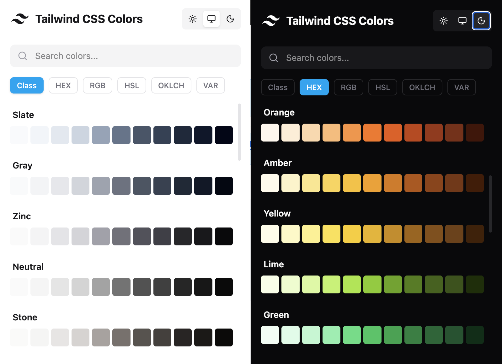

# Tailwind CSS Color Picker Extension

A beautiful and efficient Chrome extension for quickly accessing the Tailwind CSS color palette. Built with React, Vite, and Tailwind CSS, this tool allows developers to copy colors in various formats, including class names, HEX, RGB, HSL, OKLCH, and CSS variables.



## Features

- **Standard Palette:** Includes the full Tailwind CSS default color palette (Slate, Gray, Zinc, Red, Blue, etc., from 50 to 950).
- **Multiple Formats:** Copy colors as:
  - Class Name (e.g., `bg-sky-500`)
  - HEX (e.g., `#0ea5e9`)
  - RGB (e.g., `rgb(14, 165, 233)`)
  - HSL (e.g., `hsl(199, 89%, 48%)`)
  - OKLCH (e.g., `oklch(0.592 0.245 238.815)`)
  - CSS Variable (e.g., `var(--sky-500)`)
- **Search:** Instant search to filter colors by name (e.g., "sky", "emerald").
- **Theme Support:** Automatically adapts to your system's dark/light mode preference, with manual override controls.
- **Modern UI:** Clean, responsive interface inspired by Shadcn UI.

## Tech Stack

- **Framework:** [React](https://react.dev/) + [Vite](https://vitejs.dev/)
- **Styling:** [Tailwind CSS v4](https://tailwindcss.com/)
- **Icons:** [Lucide React](https://lucide.dev/)
- **Color Utilities:** [colord](https://github.com/omgovich/colord) & [culori](https://github.com/ghosh/culori)
- **Package Manager:** [Bun](https://bun.sh/)

## Installation & Development

### Prerequisites

- [Bun](https://bun.sh/) (or Node.js/npm)

### Setup

1.  **Clone the repository:**
    ```bash
    git clone https://github.com/your-username/tailwindcss-color-picker.git
    cd tailwindcss-color-picker
    ```

2.  **Install dependencies:**
    ```bash
    bun install
    ```

3.  **Build the project:**
    ```bash
    bun run build
    ```
    This will generate the production build in the `dist` folder.

### Load into Chrome

1.  Open Chrome and navigate to `chrome://extensions/`.
2.  Enable **Developer mode** by toggling the switch in the top right corner.
3.  Click on the **Load unpacked** button.
4.  Select the `dist` directory from your project folder.
5.  The **Tailwind Color Picker** extension should now appear in your extensions list.

## License

MIT